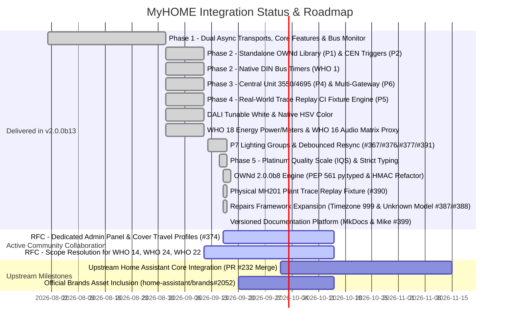
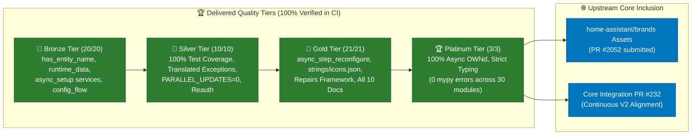

# MyHOME for Home Assistant — Project Roadmap & Community Consultation

Welcome to the development roadmap and community consultation for the **MyHOME for Home Assistant** integration.

Our overarching mission is to provide the most reliable, complete, and high-performance integration between Home Assistant and the BTicino / Legrand SCS OpenWebNet ecosystem. We adhere to strict standards: **zero-latency asynchronous architecture**, **hardware-level protocol fidelity**, **100% automated test coverage**, and **full Home Assistant Core 2025/2026 compatibility**.

---

## 🗺️ Current Delivery Status (Unified Beta v2.0.0b13 & Platinum IQS)

Through intense community collaboration and engineering, the major architectural milestones originally planned across Phases 1, 2, 3, and 4 have been **consolidated, fully implemented, and validated with 100% statement and branch test coverage** in the **v2.0.0b13 Unified Beta**. Furthermore, **Phase 5 (Home Assistant Integration Quality Scale)** has been achieved ahead of schedule, with the integration officially qualifying for the **🏆 Platinum Quality Scale** and strict typing enforced with zero errors across all modules.



---

## 📦 What is Shipped & Operational in v2.0.0b13

The following table summarizes the completed architectural features and protocol subsystems verified in the current release:

| Priority / Feature | Subsystem | Implementation Status | Highlights |
|---|---|---|---|
| **Standalone Protocol Engine (P1)** | Core | ✅ **Shipped** (`OWNd 2.0.0b8`) | Extracted into an independent, strongly typed Python library on PyPI; PEP 561 `py.typed` compliance, optimized HMAC-SHA256 handshake ($O(N)$ string generation), shared with CLI tools and MCP servers. |
| **Lighting Groups & General Debounced Resync (P7)** | WHO=1 | ✅ **Shipped** (#367, #376, #377, #391) | Declared groups in `myhome.yaml` (`where: '#G'`, optional `members:`) with aggregate status or `assumed_state`; 250 ms debounced sweep with bidirectional echo window and per-address cancellation; truthful event emission and centralized `FrameRouter` integration. |
| **Strict Typing & Platinum Quality Seal** | Core / IQS | ✅ **Shipped** (`quality_scale.yaml`) | 100% compliance across all Bronze, Silver, Gold, and Platinum rules; strict `mypy` typing with 0 errors across all 30 integration modules. |
| **CEN / CEN+ UI Device Triggers (P2)** | WHO=15 / 25 | ✅ **Shipped** | First-class Home Assistant UI device triggers with string-preserved addressing (`"0001"`), gateway MAC isolation, and all 8 press/held/release actions. |
| **Native Hardware Bus Timers** | WHO=1 | ✅ **Shipped** | Offloaded countdown timers on Legrand DIN actuators (F411) via `myhome.turn_on_timed` or `timer`/`duration` parameters in `light.turn_on` / `switch.turn_on`. |
| **Central Unit Coordination (P4)** | WHO=4 | ✅ **Shipped** | Dedicated master coordination for 99-zone Central Unit (`#0`, model 3550) and 4-zone Central Unit (`#0#1`, model 4695). Master Seasonal switches propagate to subordinate zones. |
| **Multi-Gateway Isolation (P6)** | Core / Dispatcher | ✅ **Shipped** | Namespaced event dispatchers (`f"myhome_cen_event_{mac}"`) and device trigger filtering by parent gateway MAC (`via_device`), eliminating cross-talk across multi-gateway plants. |
| **Real-World CI Trace Replay (P5)** | Testing / CI | ✅ **Shipped** | Automated pytest fixture engine (`tests/test_trace_replay.py`) replaying frozen on-wire bus captures (issue #247 MHS1, issue #297 F454, MH200 physical plant, and MH201 physical plant #390) directly against HA state machines. |
| **DALI Tunable White & Dimmers** | WHO=1 | ✅ **Shipped** | DALI DT8 tunable white (Kelvin 2000K–6535K / mireds, Dimension 14), HSV color auto-promotion (Dimension 12), and dimming speed curves. |
| **Fancoil Thermoregulation & Antifreeze Target** | WHO=4 | ✅ **Shipped** (#383) | 3-speed fancoil control (`auto`, `low`, `medium`, `high`) using dimension 11, temperature offset tracking, startup sweeps, and active antifreeze target preservation across sweeps. |
| **Cover Virtual Positioning & Delivery Protection** | WHO=2 | ✅ **Shipped** (#302, #319, #380) | Virtual travel-time positioning, 60s hardware cutoff safety guard, live bus calibration service (`myhome.calibrate_cover`), and delivery failure motion abort preventing phantom position advances. |
| **Sound System 2.0 & Streaming Proxy**| WHO=16 | ✅ **Shipped** | Multi-room matrix amplifier control (F441/F441M), volume normalization (0–31 scale), software mute, and Dynamic Streaming Proxy for Music Assistant / Spotify. |
| **Energy Management & Metering** | WHO=18 | ✅ **Shipped** | Instantaneous power (W), line voltage (V), current (mA), and energy counters wired into Home Assistant energy sensors. |
| **Burglar Alarm** | WHO=5 | ✅ **Shipped** | Partitions, arm away/home, disarm, panic trigger, and zone 0 synchronization for central units (3485/3486). |
| **Dry Contacts & Technical Alarms** | WHO=25 | ✅ **Shipped** | Dynamic discovery, inverted contact states, and event dispatching for Legrand 3477 binary sensors. |
| **Gateway Session Supervisor & Latency Tuning** | Core / Gateway | ✅ **Shipped** (#378) | Profile-driven `command_session_idle_timeout` to support high-latency or legacy gateway architectures (e.g. MH201, MH200N). |
| **Lovelace Bus Monitor Card** | Frontend | ✅ **Shipped** (`<myhome-bus-card>`) | Live scrolling stream, color-coded WHO badges, syntax injector, local timestamp rendering, and 1-click **"📋 Report Issue / Copy Trace"** clipboard exporter. |

---

## 🗳️ Community RFC: How Should We Deal With the Last Remaining Items?

With the foundational architecture and primary subsystems delivered, only a small set of specialized protocol capabilities remains from the original RFC #248 gap analysis. 

We invite community members, certified installers, and power users to review the options below and share their input in [**RFC Discussion #248**](https://github.com/orgs/OpenWebNet-HA/discussions/248):

---

### 1. 💡 P7: Lighting Groups & General Sync (`WHO = 1`) — ✅ Resolved & Shipped

#### The Technical Context:
In OpenWebNet, lighting actuators can be triggered individually (`WHERE=10`), by group (`WHERE=#1` through `#255`), by environment/room (`WHERE=room`), or generally across the whole plant (`WHERE=0`). 
In ideal installations, actuators broadcast individual status frames (`*1*0*10##`, `*1*0*11##`) after executing a group or general command. However, on older gateways or specific actuator configurations, actuators do **not** emit individual status messages, leaving Home Assistant entities out of sync with the physical lights.

#### Delivered Architecture (PRs #367, #376, #377, #391):
Community consensus and engineering converged on a robust two-tier hybrid approach, fully delivered and validated in **v2.0.0b12**:

1. **Truthful Broadcast Event Dispatching (#367)**: `myhome_group_light_event`, `myhome_area_light_event`, and `myhome_general_light_event` report a truthful `event` — strictly `on`/`off` for knowable WHATs, never firing a false `off` for speed, dimming, or toggle frames.
2. **Declared Groups (#376)**: Groups are declared in `myhome.yaml` under `groups:` (`where: '#G'`, optional `members:`), co-located with `lock_features` (#364). When `members` is specified, state is derived dynamically from member lights like `light.group`; otherwise, it operates as an `assumed_state` light.
3. **Centralized FrameRouter Integration (#391)**: `MyHOMELightGroup` implements the standardized `FrameRouter` interface (`handle_event`), enforced by type checking in `MyHOMEEntity` and an automated PR checklist.
4. **Bidirectional Debounced Fallback Sweep (#377)**: A group, area, or general command arms a 250 ms debounce window with per-address cancellation. If individual member statuses echo spontaneously (as confirmed on F461, F429G, F454, and physical MH200 captures), the sweep is cancelled. If individual replies do not arrive within the window, a targeted status sweep (`*#1*#G##` / `*#1*A##`) fires, ensuring complete synchronization without bus congestion.

---

### 2. 🪟 P3: Cover Calibration & Dedicated Administration Panel (`WHO = 2`)

#### The Technical Context:
Home Assistant provides **virtual travel-time positioning** for all covers (calculating percentage open/closed based on configured travel duration).
Legrand advanced shutter actuators (such as the 67557, LN4672M2, and F401) support native hardware positioning via Dimension 10 (`*#2*WHERE*10*Position*...##`) and an automatic travel calibration routine (`shutterRun=AUTO`).

#### Shipped Foundation:
* **Interactive Live Bus Calibration Engine (#302, #319)**: Built-in `myhome.calibrate_cover` service with automatic stopwatch timing directly from on-wire frames, `Calibrate Up` and `Calibrate Down` configuration buttons (`EntityCategory.CONFIG`), `copied_from` timing sharing across identical shutters, and a 60-second hardware cutoff safety guard.
* **Delivery Failure Motion Abort (#380)**: Immediately stops virtual movement and prevents phantom position advance when a cover frame is rejected or unconfirmed by the gateway.

#### Active Community Collaboration: Dedicated Administration Panel (#374):
Work is actively underway in **PR #374** (by @xtimmy86x, following [Discussion #270](https://github.com/orgs/OpenWebNet-HA/discussions/270)) introducing an experimental administration panel:
* **Asymmetric Travel Profiles**: Configurable independent opening and closing durations per cover.
* **Guided & Batch Calibration**: Guided, automatic, and selected-cover batch calibration workflows with explicit preview and atomic persistence.
* **Integrated Diagnostics & Bus Monitor**: Embedded live trace capture, frame filtering, transmission, and diagnostic export directly inside the administration panel.
* **WHO Category Inventory**: Categorized gateway entity inventory with search and area management.

---

### 3. 🔒 WHO 14: Actuator Maintenance Locks & Relay Cycle Counters — ✅ Community Consensus

#### The Technical Context:
OpenWebNet WHO 14 handles actuator diagnostics, relay cycle counters, and hardware maintenance locks (preventing physical buttons from toggling a relay during maintenance or security states). 

#### Community Resolution:
* **Diagnostic Buttons Preserved (#353)**: Actuator lock and unlock controls are exposed as configuration buttons (`button.py`) under `EntityCategory.CONFIG`, allowing maintenance commands without creating cluttering lock entities.
* **Bus Monitor Visibility**: WHO 14 frames remain fully visible, parsed, and color-coded in the Lovelace Bus Monitor card for diagnostic troubleshooting.

---

### 4. 🏢 WHO 24: Legrand Commercial Lighting Management Room Controllers — ✅ Resolved Scope

#### The Technical Context:
WHO 24 is designed for commercial Legrand Lighting Management controllers (**BMNE500**, **BMview**, **002645**) used in office buildings and schools. Residential MyHOME plants almost universally use standard WHO=1 lighting and DALI gateways (F429).

#### Community Resolution:
* **Scope Deferred**: WHO 24 is deferred as an optional standalone extension, keeping core integration scope focused on residential and commercial SCS bus systems.

---

### 5. 🎵 WHO 22: Legacy Multi-Room FM Tuner & RDS Navigation — ✅ Formally Deprecated

#### The Technical Context:
WHO 22 defines protocol frames for obsolete Legrand analog FM radio tuner modules (frequency stepping, station presets, and RDS text streaming). 

#### Community Resolution:
* **Formally Deprecated**: Obsolete analog FM radio controls are formally deprecated in favor of the **Dynamic Streaming Proxy** on the F441 matrix, enabling high-fidelity digital streaming from **Music Assistant**, **Spotify Connect**, and AirPlay directly into wired SCS zones.

---

## 🏆 Phase 5 Achieved: Home Assistant Platinum Quality Scale

Originally planned as an extended post-beta milestone, all requirements for the **Home Assistant Integration Quality Scale** have been **fully implemented and verified ahead of schedule**, elevating MyHOME directly to the **🏆 Platinum Quality Scale** ([Home Assistant Integration Quality Scale](https://developers.home-assistant.io/docs/core/integration-quality-scale/)).

Under Home Assistant Core architecture, achieving Platinum requires 100% strict compliance across all Bronze, Silver, and Gold criteria without exception.

### 📊 Quality Scale Compliance & Architecture



### 📋 Detailed Quality Scale Audit Summary

#### 1. 🥉 Bronze Architectural Alignments — ✅ 100% Complete (20/20)
* **`has-entity-name = True`**: Fully implemented across all entity platforms (`MyHOMEEntity` in `custom_components/myhome/myhome_device.py`). Primary entities inherit device naming (`_attr_name = None`), and manual `entity_id` assignment has been eliminated in favor of core registry naming (`tests/test_entity_naming.py`).
* **`runtime-data`**: Replaced all legacy `hass.data[DOMAIN]` global state with typed `ConfigEntry.runtime_data` (`MyHOMERuntimeData` in `data.py`), enforced statically by `scripts/verify_ha_standards.py`.
* **`action-setup`**: Service action registrations (`sync_time`, `send_message`, `sweep_bus`, `turn_on_timed`, etc.) are centralized in `services.py` and registered once in `async_setup`, preventing listener teardown during entry reloads.

#### 2. 🥈 Silver Robustness & Quality Hardening — ✅ 100% Complete (10/10)
* **`test-coverage` (100.0% Strict Statement & Branch Coverage)**: Surpasses the core >95% requirement. MyHOME enforces strict 100.0% statement coverage across all integration modules (over 1,700 automated tests passing with zero misses, guarded by `tests/test_coverage_enforcer.py` and CI).
* **`action-exceptions`**: Service actions validate all inputs and raise `homeassistant.exceptions.ServiceValidationError` or `HomeAssistantError` mapped directly to localized translation keys under `exceptions` in `strings.json`.
* **`parallel-updates`**: Declares explicit `PARALLEL_UPDATES = 0` across all platform modules (`light.py`, `switch.py`, `cover.py`, `climate.py`, `sensor.py`, `binary_sensor.py`, `media_player.py`, `button.py`, `alarm_control_panel.py`) for non-blocking local push stream processing.

#### 3. 🥇 Gold User Experience & Framework Features — ✅ 100% Complete (21/21)
* **`reconfiguration-flow`**: Fully supports `async_step_reconfigure` in `config_flow.py` allowing users to update IP address, port, password, or connection mode directly from the Home Assistant UI.
* **`strings.json` & `icon-translations`**: `custom_components/myhome/strings.json` and `icons.json` serve as the canonical source of truth for all entity states, configuration forms, device classes, and service actions.
* **`repair-issues`**: Active integration of Home Assistant's Repairs framework (`async_create_issue`):
  - `gateway_identity_mismatch` & `gateway_identity_corrected`: Proactively informs users if configured model conflicts with WHO=13 hardware telemetry.
  - `unconfigured_timezone` (PR #387): Automatically flags legacy gateway timezone sentinel `999` with remediation guidance.
  - `unknown_model` (PR #388): Captures unmapped WHO=13 hardware codes (`999`) and directs users to diagnostic trace submission.
* **Complete Core Documentation Suite**: Authored all 10 Gold standard documentation chapters under `docs/configuration/` (Architecture, Supported Functions, Gateways, Services, Runtime Behaviour, CEN/CEN+, Sound System, Troubleshooting, Lovelace Recipes, and Known Limitations).
* **`quality_scale.yaml`**: Official compliance manifest actively tracked at `custom_components/myhome/quality_scale.yaml` and verified by `scripts/quality_scale_report.py`.

#### 4. 🏆 Platinum Engineering Tier — ✅ 100% Complete (3/3)
* **`async-dependency`**: The underlying `OWNd` protocol engine (v2.0.0b7) is a 100% non-blocking asyncio library with zero synchronous blocking socket calls.
* **`inject-websession`**: Formally exempt (all communication operates over raw OpenWebNet binary/text TCP streams; no HTTP websession required).
* **`strict-typing`**: Enforces `mypy --strict` with **0 errors across all 30 integration modules**. Cascading type errors were eliminated alongside `OWNd 2.0.0b7`'s PEP 561 `py.typed` marker (PR #393), guarded in CI by `scripts/typing_ratchet.py`.

#### 5. 🌐 Upstream Ecosystem & Core PR Status
* **Branding Assets (`brands`)**: SVG and high-resolution PNG brand assets submitted in [`home-assistant/brands#2052`](https://github.com/home-assistant/brands/pull/2052).
* **Core Integration PR #232**: Comprehensive PR [`#232`](https://github.com/OpenWebNet-HA/MyHOME/pull/232) continuously synced to `v2-phase1-architecture`, ready for upstream core maintainer review with full 2026.3+ / Python 3.14 certification.

---

## 📊 Real-World Trace Coverage Schematic (What We Have vs. What We Need)

To eliminate regression risks and verify complex timing constraints, our **Trace Replay Engine** (`tests/test_trace_replay.py`) replays authentic on-wire captures against the Home Assistant integration. 

Below is the definitive schematic of which gateways and subsystems are **already covered by real-world captures in CI**, and where we **still need community recordings**.

### 🗺️ System Coverage Overview

```mermaid
graph TD
    subgraph Gateways["🏛️ Gateways & Transports"]
        GW_MHS1["🟢 MyHomeServer1<br/>(Full 70+ dev plant)"]
        GW_F454["🟢 F454<br/>(High-speed IP)"]
        GW_MH200["🟢 MH200 / MH200N<br/>(107 Frames / Physical Plant)"]
        GW_F461["🟢 F461<br/>(DIN Web Server)"]
        GW_3578["🟡 Legrand 3578<br/>(Serial/ZigBee Loopback)"]
        GW_MH201["🟢 MH201<br/>(100 Frames / Physical Plant)"]
        GW_MH202["🔴 MH202<br/>(Scenario Gateway)"]
        GW_F455["🔴 F455<br/>(Dual-Bus Routing)"]
    end

    subgraph Subsystems["⚙️ Protocol Subsystems & Scenarios"]
        SUB_LIGHT["🟢 Lighting / Relays (WHO 1)<br/>(4-digit & on/off covered)"]
        SUB_DALI["🟢 DALI DT8 / RGB (WHO 1)<br/>(Dim 14 Tunable White)"]
        SUB_TIMER["🟡 DIN Bus Timers (WHO 1)<br/>(Synthetic test covered)"]
        SUB_GRP["🟢 Lighting Groups (P7)<br/>(declared groups + debounced resync, #376/#377)"]
        SUB_COV_V["🟢 Covers Virtual (WHO 2)<br/>(Travel-time positioning & #380 delivery abort)"]
        SUB_COV_H["🟢 Covers Hardware (WHO 2)<br/>(Dim 10 status covered)"]
        SUB_COV_CAL["🔴 Cover Calibration (P3)<br/>(shutterRun=AUTO traces)"]
        SUB_CU3550["🟢 Central Unit 3550 (WHO 4)<br/>(99-zone master mode & #383 antifreeze target)"]
        SUB_CU4695["🔴 Central Unit 4695 (WHO 4)<br/>(4-zone master mode)"]
        SUB_ENERGY["🟢 Energy Management (WHO 18)<br/>(W, V, mA live frames)"]
        SUB_DRY["🟢 Dry Contacts (WHO 25)<br/>(Technical alarms & AUX)"]
        SUB_CEN["🟡 Physical Pushbuttons (WHO 15/25)<br/>(Rapid multi-click / held)"]
        SUB_ALARM["🟡 Burglar Alarm (WHO 5)<br/>(Partitions & central unit)"]
        SUB_ROUTER["🟢 F422 Bus Router<br/>(Cross-bus #4#02 routing covered)"]
    end

    subgraph Engine["🧪 CI Test Suite"]
        HARNESS["tests/test_trace_replay.py<br/>(100% Deterministic Replay)"]
    end

    GW_MHS1 --> HARNESS
    GW_F454 --> HARNESS
    GW_MH200 --> HARNESS
    GW_MH201 --> HARNESS
    GW_F461 --> HARNESS
    SUB_LIGHT --> HARNESS
    SUB_DALI --> HARNESS
    SUB_GRP --> HARNESS
    SUB_COV_V --> HARNESS
    SUB_COV_H --> HARNESS
    SUB_CU3550 --> HARNESS
    SUB_ENERGY --> HARNESS
    SUB_DRY --> HARNESS
    SUB_ROUTER --> HARNESS

    classDef covered fill:#2e7d32,stroke:#1b5e20,color:#ffffff;
    classDef partial fill:#f57f17,stroke:#e65100,color:#ffffff;
    classDef needed fill:#c62828,stroke:#b71c1c,color:#ffffff;

    class GW_MHS1,GW_F454,GW_MH200,GW_MH201,GW_F461,SUB_LIGHT,SUB_DALI,SUB_GRP,SUB_COV_V,SUB_COV_H,SUB_CU3550,SUB_ENERGY,SUB_DRY,SUB_ROUTER covered;
    class GW_3578,SUB_TIMER,SUB_CEN,SUB_ALARM partial;
    class GW_MH202,GW_F455,SUB_COV_CAL,SUB_CU4695 needed;
```



---

### 🏛️ Table 1: Gateway Models & Hardware Transports

| Gateway Model | Status | Current Evidence / Fixture | Community Trace Needed / Target Scenario |
|---|---|---|---|
| **MyHomeServer1 (MHS1)** | 🟢 **Covered** | `tests/fixtures/plants/issue_247_myhomeserver1/` (100 on-wire frames, issue #247; anonymized) | *None needed — full production plant active in CI.* |
| **F454** | 🟢 **Covered** | `tests/fixtures/plants/issue_297_f454/` (127 on-wire frames, issue #297; anonymized) | *None needed — full high-speed IP session active in CI.* |
| **MH200 / MH200N** | 🟢 **Covered** | `tests/fixtures/plants/mh200_physical_plant/` (107 on-wire frames from physical MH200) | *None needed — full physical plant active in CI (62 lights, 7 switches, 11 covers across F422 interfaces).* |
| **F461 Web Server** | 🟢 **Covered** | Issue #273 capture (@lyubomirtraykov) | *None needed — DALI DT8 ballasts verified.* |
| **Legrand 3578 USB/Serial** | 🟡 **Partial** | Unit test loopback in `tests/test_gateway.py` | **Real-world USB serial stream**: Raw byte capture from physical OpenZigBee installation (`WHERE=<id>#9`). |
| **MH201** | 🟢 **Covered** | `tests/fixtures/plants/mh201_physical_plant/` (100 on-wire frames from physical MH201, issue #378 / PR #390; anonymized) | *None needed — physical plant active in CI (23 lights, 1 outlet, 7 advanced covers, CEN+ presses, WHO=13 device type / firmware / datetime replies).* |
| **MH202** | 🔴 **Needed** | Synthetic gateway profile tests only | **Production plant trace**: General residential traffic through an MH202 scenario programmer. |
| **F455** | 🔴 **Needed** | Synthetic dual-bus profile tests only | **Dual-bus cross-routing trace**: Simultaneous traffic routing between Bus 1 and Bus 2. |
| **F452 / F453AV / AM4890** | 🟡 **Synthetic** | Factory golden frames from `openwebnet4j` | **General trace**: Normal residential bus captures welcomed to expand gateway diversity. |

---

### ⚙️ Table 2: Subsystems, Dimensions & Edge Scenarios

| Subsystem & Domain | Status | Current Evidence / Fixture | Community Trace Needed / Target Scenario |
|---|---|---|---|
| **Lighting (WHO = 1) — Relays & Dimmers** | 🟢 **Covered** | issue #247 capture (F411U2, F418, 4-digit addressing `1000`, `0910`) + MH200 plant (62 lights) | *Baseline covered.* |
| **Lighting (WHO = 1) — DALI Tunable White** | 🟢 **Covered** | Lyubomir Traykov capture (Dimension 14, Kelvin 2000K–6535K / mireds) | *Baseline covered.* |
| **Lighting (WHO = 1) — Native DIN Timers** | 🟡 **Synthetic** | Unit tests in `tests/test_timed_lighting.py` | **Actuator countdown trace**: Capture of physical F411 relay executing Dim 2 (`*#1*WHERE*#2*H*M*S##`) or preset temporization. |
| **Lighting (WHO = 1) — Groups & General (P7)** | 🟢 **Covered** | F461/F429G/F454 traces + physical MH200 golden sample burst fixture (`tests/test_issue_368_resync.py`); declared groups (#376), debounced sweep (#377), and FrameRouter (#391) | *None needed — full group and general broadcast resync engine active in CI.* |
| **Covers (WHO = 2) — Travel-Time Positioning** | 🟢 **Covered** | issue #247 capture (`*2*0*42##`, LN4661M2) + 60s hardware cutoff guard (#319) + motion abort on delivery failure (#380) | *Baseline covered.* |
| **Covers (WHO = 2) — Hardware Feedback** | 🟢 **Covered** | issue #247 capture (`*#2*73*10*10*0*001*0##`) | *Baseline covered.* |
| **Covers (WHO = 2) — Calibration (P3)** | 🔴 **Needed** | Synthetic dimension 10 tests only (on-bus travel-time calibration live in v2; PR #374 admin panel in review) | **Hardware calibration trace**: Bus recording during physical calibration (`shutterRun=AUTO`) on Legrand 67557, LN4672M2, or F401. |
| **Thermoregulation (WHO = 4) — 99-Zone CU 3550** | 🟢 **Covered** | issue #247 capture (`#0` central unit + zone thermostats) + antifreeze target preservation across sweeps (#383) | *Baseline covered.* |
| **Thermoregulation (WHO = 4) — 4-Zone CU 4695** | 🔴 **Needed** | Synthetic unit tests in `tests/test_climate.py` | **4-zone central unit trace**: Physical capture from a plant running a 4-zone 4695 / HD4695 (`#0#1`) central unit. |
| **Thermoregulation (WHO = 4) — 4-Pipe Fancoil** | 🟡 **Synthetic** | Unit tests with dimension 11 | **4-pipe heating/cooling trace**: Physical speed toggles on 4-pipe fancoil systems. |
| **Burglar Alarm (WHO = 5)** | 🟡 **Synthetic** | Golden frames from `openwebnet4j` | **Central unit alarm trace**: Arm/disarm/alarm frames from physical 3485 / 3486 central units. |
| **CEN / CEN+ (WHO = 15 / 25) — Dry Contacts** | 🟢 **Covered** | issue #247 capture (F482V12 / 3477 binary sensors) | *Baseline covered.* |
| **CEN / CEN+ (WHO = 15 / 25) — Pushbuttons** | 🟡 **Synthetic** | Unit tests in `tests/test_device_trigger.py` | **Physical wall switch bursts**: Rapid multi-click, held, and release events from physical pushbuttons under normal usage. |
| **Sound System (WHO = 16) — Matrix & Proxy** | 🟢 **Covered** | issue #247 capture + mock F441 tests | *Baseline covered.* |
| **Energy Management (WHO = 18)** | 🟢 **Covered** | issue #247 capture (30 frames of active power, 602 W) | *Baseline covered.* |
| **F422 Cross-Bus Router** | 🟢 **Covered** | Physical MH200 plant trace (`tests/fixtures/plants/mh200_physical_plant/`, 11 covers routed via `#4#02`) | *None needed — physical F422 cross-bus addressing active in CI.* |

---

### 📋 Dual-Track Guide: How Community Testers Can Submit a Trace

We offer **two simple ways** to contribute real-world bus traces, tailored to your technical setup:

#### 🏷️ Track A: Zero-CLI via Home Assistant UI (Fastest & Easiest)
Ideal for standard users running Home Assistant with the MyHOME integration:
1. **Sweep the Bus**: In Home Assistant, go to **Developer Tools** > **Services** and call `myhome.sweep_bus` (or trigger it from the Lovelace Bus Monitor Card). This actively queries all lighting, cover, HVAC, and gateway diagnostic states in under 3 seconds.
2. **Download Diagnostics**: Navigate to **Settings** > **Devices & Services** > **MyHOME** > click the three dots (`⋮`) > **Download diagnostics** (or click **`📋 Export Trace`** on the `<myhome-bus-card>`).
3. **Submit**: Attach the downloaded `.json` file to [**RFC Discussion #248**](https://github.com/orgs/OpenWebNet-HA/discussions/248) or open a GitHub Issue.
4. *Privacy Guarantee*: Home Assistant and MyHOME automatically redact all passwords, authentication tokens, and private credentials before exporting.

#### 💻 Track B: Standalone Python Tool (Test Benches & Integrators)
Ideal for installers, bench testers, and developers testing isolated gateways without Home Assistant installed:
1. **Run the Trace Recorder**:
   ```bash
   python scripts/record_gateway_trace.py --host 192.168.1.35 --password 12345 --model MH202
   ```
2. **Active Sweep & Listen**: The script automatically executes the diagnostic status sweep, listens for ambient button presses or scenario bursts, and scrubs sensitive credentials.
3. **Drop & Commit**: The tool writes a complete ready-to-test fixture folder in `tests/fixtures/plants/<model>_plant/`.
4. **Instant CI Verification**: Run `pytest tests/test_trace_replay.py` — our parameterized test runner automatically discovers and tests your plant with zero additional test code required! Submit a Pull Request.

---

## 💬 How to Participate

Please share your feedback, real-world bus captures, and advice in our GitHub discussions:

👉 **[Join the Community Discussion on RFC #248](https://github.com/orgs/OpenWebNet-HA/discussions/248)**  
👉 **[Report Beta Issues or Submit Bus Traces](https://github.com/OpenWebNet-HA/MyHOME/issues)**

