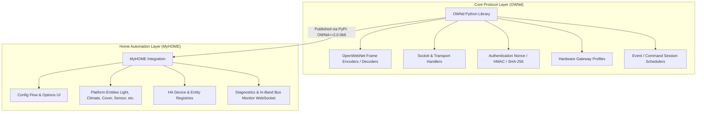

# Architecture & Anti-Drift Safeguards

This document explains the architectural separation between the **`OWNd`** OpenWebNet protocol library and the **`MyHOME`** Home Assistant custom integration, along with the multi-tiered **Anti-Drift Sentinel System** designed to ensure both codebases never diverge.

---

## 1. Architectural Overview: The Split Model

Starting with **MyHOME v2.0** and **OWNd 2.0**, the OpenWebNet protocol stack and the Home Assistant integration are cleanly decoupled into two dedicated repositories:



### Why Decouple?
1. **Single Source of Truth**: Protocol decoding, dimension parsing, and frame syntax rules exist in one authoritative library rather than duplicated or vendored across multiple projects.
2. **Reusability**: Other automation frameworks, standalone CLI tools, diagnostic bridges, and testing scripts can leverage `OWNd` without pulling in Home Assistant dependencies.
3. **Independent Release Cadence**: Protocol fixes and newly decoded WHO dimensions can be tested and released on PyPI independently.

---

## 2. The Drift Problem

When a core protocol library and a downstream consumer live in separate repositories, three critical divergence risks arise:

1. **Breaking Contract Changes**: A parameter change, field renaming, or return type modification in `OWNd` passes all `OWNd` unit tests but breaks `MyHOME` entities or listeners.
2. **Parser Regressions**: A change to a regular expression or frame parsing logic in `OWNd` causes downstream entity state updates or device triggers to silently fail.
3. **Dependency Desynchronization**: `MyHOME` pins a specific release in `manifest.json`, but development branches assume newer unreleased features (or vice versa).

To permanently prevent these issues, the project implements a **3-Pillar Anti-Drift Architecture**.

---

## 3. The 3-Pillar Anti-Drift Architecture

```mermaid
graph TD
    subgraph "Pillar 1: Shift-Left Downstream Canary (OWNd)"
        O1[OWNd PR or Commit] --> O2[Build Candidate OWNd Wheel]
        O2 --> O3[Checkout MyHOME integration]
        O3 --> O4[Run full MyHOME 1,600+ test suite]
        O4 -->|Any failure| O5[Block OWNd PR from Merging]
        O4 -->|All green| O6[Allow OWNd Merge]
    end

    subgraph "Pillar 2: Upstream Canary CI (MyHOME)"
        M1[Nightly Cron 04:00 UTC] --> M2[Install git+master of OWNd]
        M2 --> M3[Run MyHOME Test Suite & Enforcers]
        M3 -->|Alert on failure| M4[Proactive Warning Before PyPI Release]
    end

    subgraph "Pillar 3: Automated Release Bump"
        R1[OWNd PyPI Release] --> R2[repository_dispatch Webhook]
        R2 --> R3[Auto-Bump manifest.json & PR in MyHOME]
    end
```



### Pillar 1: Downstream Integration Canary in `OWNd` (Shift-Left Sentinel)

The most effective safeguard is **Shift-Left Testing**: stopping breaking changes before they are ever merged into `OWNd`.

In `OpenWebNet-HA/OWNd/.github/workflows/ci.yml`, every PR and push to `master` triggers a downstream verification job:

- The runner builds and installs the candidate `OWNd` wheel.
- It clones the active development branch of `OpenWebNet-HA/MyHOME` (`v2-phase1-architecture` or `master`).
- It runs the complete automated unit test suite of `MyHOME` with **strict 100.0% line coverage enforcement**.

> [!IMPORTANT]
> A pull request to `OWNd` **cannot merge** if it breaks any behavior, parser, or assumption in `MyHOME`.

---

### Pillar 2: Upstream Canary CI in `MyHOME` (Nightly Sentinel)

To detect upstream changes before they are tagged and released to PyPI, `MyHOME` runs a nightly scheduled workflow (`.github/workflows/ownd-smoke.yml`):

- Runs daily at 04:00 UTC and on manual `workflow_dispatch`.
- Installs the cutting-edge development head of `OWNd`:
  ```bash
  pip install git+https://github.com/OpenWebNet-HA/OWNd.git@master
  ```
- Runs the complete test suite. If an unreleased commit in `OWNd` triggers a deprecation warning, subtle behavioral divergence, or test failure, the team is alerted immediately.

---

### Pillar 3: Release Auto-Bump & Pin Enforcer

To keep production and development dependencies in lock-step:

1. **Strict Version Pinning**:
   `custom_components/myhome/manifest.json` pins exact releases:
   ```json
   {
     "requirements": [
       "OWNd==2.0.0b6"
     ]
   }
   ```
2. **PyPI Release Webhook**:
   When `OWNd` tags and publishes a new release to PyPI (e.g. `2.0.0b7`), a GitHub Actions `repository_dispatch` event notifies `MyHOME`. A dedicated workflow automatically updates `manifest.json`, regenerates the lockfile/specs, verifies 100% coverage, and opens a pre-validated PR.

---

## 4. Test Coverage & Quality Enforcers

Both repositories enforce automated zero-tolerance quality gates:

| Quality Gate | Standard | Enforced By |
|---|---|---|
| **Statement Coverage** | **Strict 100.0%** (0 missing lines across all integration modules) | `pytest --cov --cov-report=term-missing` |
| **Linting & Formatting** | **0 Ruff Violations** | `ruff check .` |
| **Home Assistant Standards** | **Gold / Platinum Scale** | `scripts/verify_ha_standards.py` |
| **Upstream Compatibility** | `dev`, `beta`, `stable` | `.github/workflows/ha-upstream-compat.yml` |

By combining Shift-Left testing in `OWNd` with nightly canary builds and automated release bumping in `MyHOME`, protocol drift is structurally impossible.
