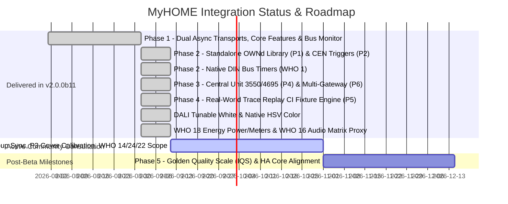

# MyHOME for Home Assistant — Project Roadmap & Community Consultation

Welcome to the development roadmap and community consultation for the **MyHOME for Home Assistant** integration.

Our overarching mission is to provide the most reliable, complete, and high-performance integration between Home Assistant and the BTicino / Legrand SCS OpenWebNet ecosystem. We adhere to strict standards: **zero-latency asynchronous architecture**, **hardware-level protocol fidelity**, **100% automated test coverage**, and **full Home Assistant Core 2025/2026 compatibility**.

---

## 🗺️ Current Delivery Status (Unified Beta v2.0.0b11)

Through intense community collaboration and engineering, the major architectural milestones originally planned across Phases 1, 2, 3, and 4 have been **consolidated, fully implemented, and validated with 100% statement and branch test coverage** in the **v2.0.0b11 Unified Beta**.



---

## 📦 What is Shipped & Operational in v2.0.0b11

The following table summarizes the completed architectural features and protocol subsystems verified in the current release:

| Priority / Feature | Subsystem | Implementation Status | Highlights |
|---|---|---|---|
| **Standalone Protocol Engine (P1)** | Core | ✅ **Shipped** (`OWNd 2.0.0b5`) | Extracted into an independent, strongly typed Python library on PyPI; shared with CLI tools and MCP servers. |
| **CEN / CEN+ UI Device Triggers (P2)** | WHO=15 / 25 | ✅ **Shipped** | First-class Home Assistant UI device triggers with string-preserved addressing (`"0001"`), gateway MAC isolation, and all 8 press/held/release actions. |
| **Native Hardware Bus Timers** | WHO=1 | ✅ **Shipped** | Offloaded countdown timers on Legrand DIN actuators (F411) via `myhome.turn_on_timed` or `timer`/`duration` parameters in `light.turn_on` / `switch.turn_on`. |
| **Central Unit Coordination (P4)** | WHO=4 | ✅ **Shipped** | Dedicated master coordination for 99-zone Central Unit (`#0`, model 3550) and 4-zone Central Unit (`#0#1`, model 4695). Master Seasonal switches propagate to subordinate zones. |
| **Multi-Gateway Isolation (P6)** | Core / Dispatcher | ✅ **Shipped** | Namespaced event dispatchers (`f"myhome_cen_event_{mac}"`) and device trigger filtering by parent gateway MAC (`via_device`), eliminating cross-talk across multi-gateway plants. |
| **Real-World CI Trace Replay (P5)** | Testing / CI | ✅ **Shipped** | Automated pytest fixture engine (`tests/test_trace_replay.py`) replaying frozen on-wire bus captures (e.g. Nicola Cavallo's 100-frame trace from F454) directly against HA state machines. |
| **DALI Tunable White & Dimmers** | WHO=1 | ✅ **Shipped** | DALI DT8 tunable white (Kelvin 2000K–6535K / mireds, Dimension 14), HSV color auto-promotion (Dimension 12), and dimming speed curves. |
| **Fancoil Thermoregulation** | WHO=4 | ✅ **Shipped** | 3-speed fancoil control (`auto`, `low`, `medium`, `high`) using dimension 11, temperature offset tracking, and startup sweeps. |
| **Sound System 2.0 & Streaming Proxy**| WHO=16 | ✅ **Shipped** | Multi-room matrix amplifier control (F441/F441M), volume normalization (0–31 scale), software mute, and Dynamic Streaming Proxy for Music Assistant / Spotify. |
| **Energy Management & Metering** | WHO=18 | ✅ **Shipped** | Instantaneous power (W), line voltage (V), current (mA), and energy counters wired into Home Assistant energy sensors. |
| **Burglar Alarm** | WHO=5 | ✅ **Shipped** | Partitions, arm away/home, disarm, panic trigger, and zone 0 synchronization for central units (3485/3486). |
| **Dry Contacts & Technical Alarms** | WHO=25 | ✅ **Shipped** | Dynamic discovery, inverted contact states, and event dispatching for Legrand 3477 binary sensors. |
| **Lovelace Bus Monitor Card** | Frontend | ✅ **Shipped** (`<myhome-bus-card>`) | Live scrolling stream, color-coded WHO badges, syntax injector, and 1-click **"📋 Report Issue / Copy Trace"** clipboard exporter. |

---

## 🗳️ Community RFC: How Should We Deal With the Last Remaining Items?

With the foundational architecture and primary subsystems delivered, only a small set of specialized protocol capabilities remains from the original RFC #248 gap analysis. 

We invite community members, certified installers, and power users to review the options below and share their input in [**RFC Discussion #248**](https://github.com/orgs/OpenWebNet-HA/discussions/248):

---

### 1. 💡 P7: Lighting Groups & General Sync (`WHO = 1`)

#### The Technical Context:
In OpenWebNet, lighting actuators can be triggered individually (`WHERE=10`), by group (`WHERE=#1` through `#255`), by environment/room (`WHERE=room`), or generally across the whole plant (`WHERE=0`). 
In ideal installations, actuators broadcast individual status frames (`*1*0*10##`, `*1*0*11##`) after executing a group or general command. However, on older gateways or specific actuator configurations, actuators do **not** emit individual status messages, leaving Home Assistant entities out of sync with the physical lights.

> [!NOTE]
> **Real-World Case Study (Issue #300)**: Installations utilizing DALI gateway interfaces (such as the **F429G**) often group ballasts into SCS groups (`WHERE = #1` .. `#255`) because F429G does not expose native DALI groups. While some modern gateways (such as the F461 in Issue #300) emit individual member status replies, older gateways do not. Currently, software-side grouping using Home Assistant native Light Groups (`light.group`) combined with `myhome_group_light_event` automations for physical wall switches is the officially recommended solution. See [Issue #300](https://github.com/OpenWebNet-HA/MyHOME/issues/300) and discussion below.

#### Open Questions for the Community:
1. **Group Mapping Definition**: Should group memberships be defined in `myhome.yaml` / UI Options (e.g. `groups: { 1: ["light.kitchen", "light.dining"] }`), or should Home Assistant trigger an asynchronous status sweep (`*#1*WHERE##`) whenever a group actuation is intercepted on the bus?
2. **Priority**: For your installation, do you actively use physical MyHOME group/general buttons, and are your entity states desynchronizing today?

---

### 2. 🪟 P3: Cover Calibration & Dynamic Hardware Position Promotion (`WHO = 2`)

#### The Technical Context:
Home Assistant currently provides **virtual travel-time positioning** for all covers (calculating percentage open/closed based on configured travel duration). 
Legrand advanced shutter actuators (such as the 67557, LN4672M2, and F401) support native hardware positioning via Dimension 10 (`*#2*WHERE*10*Position*...##`) and an automatic travel calibration routine (`shutterRun=AUTO`).

#### Open Questions for the Community:
1. **Calibration Service**: Would a `myhome.calibrate_cover` service (triggering physical calibration on the actuator) be valuable, or is manual travel-time estimation sufficient and safer?
2. **Auto-Promotion**: Should covers that report Dimension 10 frames automatically promote themselves to hardware positioning mode without user intervention?

---

### 3. 🔒 WHO 14: Actuator Maintenance Locks & Relay Cycle Counters

#### The Technical Context:
OpenWebNet WHO 14 handles actuator diagnostics, relay cycle counters, and hardware maintenance locks (preventing physical buttons from toggling a relay during maintenance or security states). 
Legrand does not publish an open specification for WHO 14; frames are largely proprietary diagnostic codes from DIN actuators.

#### Open Questions for the Community:
1. **Use Case**: Does anyone in the community have a practical automation use case for software maintenance lock switches on Legrand DIN actuators, or does this add unnecessary entity clutter?
2. **Recommendation**: Should WHO 14 remain an internal diagnostic listener (visible in the Bus Monitor card) rather than exposing Home Assistant lock entities?

---

### 4. 🏢 WHO 24: Legrand Commercial Lighting Management Room Controllers

#### The Technical Context:
WHO 24 is designed for commercial Legrand Lighting Management controllers (**BMNE500**, **BMview**, **002645**) used in office buildings and schools. It regulates maintained lux levels, daylight harvesting, and profile activation (`*24*1#Profile*WHERE##`). 
Residential MyHOME plants almost universally use standard WHO=1 lighting and DALI gateways (F429).

#### Open Questions for the Community:
1. **User Base**: Is anyone in the community running commercial BMNE500 / WHO 24 lighting controllers in their installation?
2. **Recommendation**: Should WHO 24 be deferred to an optional extension rather than core residential integration scope?

---

### 5. 🎵 WHO 22: Legacy Multi-Room FM Tuner & RDS Navigation

#### The Technical Context:
WHO 22 defines protocol frames for obsolete Legrand analog FM radio tuner modules (frequency stepping, station presets, and RDS text streaming). 
Modern installations stream digital music from **Music Assistant**, **Spotify Connect**, or AirPlay directly into BTicino audio zones via the **Dynamic Proxy** pattern on the F441 matrix.

#### Open Questions for the Community:
1. **Deprecation**: Should WHO 22 FM tuner controls be formally deprecated in favor of our active F441 Dynamic Streaming Proxy?

---

## 🥇 Phase 5: Home Assistant Integration Quality Scale — Golden Quality Seal (Post-Beta)

Following the conclusion of the beta testing period and community RFC consultation, all engineering efforts will transition to qualifying for the **official Home Assistant 🥇 Golden Quality Seal** ([Home Assistant Integration Quality Scale](https://developers.home-assistant.io/docs/core/integration-quality-scale/)) and preparing the codebase for upstream inclusion in Home Assistant Core.

Under Home Assistant's grading architecture, an integration cannot achieve Gold without **100% compliance across all Bronze and Silver rules as well**.

### 📊 Quality Scale Compliance & Gap Analysis

```mermaid
graph LR
    subgraph Prerequisites["🥉 Bronze & 🥈 Silver Prerequisites"]
        B1["has_entity_name = True"]
        B2["entry.runtime_data"]
        B3["async_setup Service Actions"]
        S1["Service Action Exceptions"]
        S2["PARALLEL_UPDATES Declarations"]
    end

    subgraph GoldMilestones["🥇 Gold Tier Implementation"]
        G1["async_step_reconfigure"]
        G2["strings.json & Entity Translations"]
        G3["icons.json Translations"]
        G4["Repairs Framework (async_create_issue)"]
        G5["quality_scale.yaml Tracking"]
    end

    subgraph Upstream["🌐 Upstream Inclusion & Assets"]
        U1["home-assistant/brands Assets"]
        U2["Official Core Docs (All 10 rules)"]
        U3["Core Integration PR"]
    end

    Prerequisites --> GoldMilestones --> Upstream
```



### 📋 Detailed Workstream Breakdown

#### 1. 🥉 Bronze Architectural Alignments (Core Prerequisites)
* **`has-entity-name`**: Migrate all entity implementations (`MyHOMEEntity` in `custom_components/myhome/myhome_device.py`) from `self._attr_has_entity_name = False` to `True`. Primary entities (where the device and entity are one, such as a single light actuator or thermostat) will set `_attr_name = None` to inherit the device's friendly name. Remove manual `self.entity_id` overrides to allow Home Assistant Core's registry to handle naming.
* **`runtime-data`**: Deprecate global `hass.data[DOMAIN][mac]` state storage in favor of modern `ConfigEntry.runtime_data` (introduced in HA 2024.4). Establish a typed `MyHomeData` dataclass and `type MyHomeConfigEntry = ConfigEntry[MyHomeData]`.
* **`action-setup`**: Move service action registrations (`sync_time`, `send_message`, `sweep_bus`, `turn_on_timed`) out of `async_setup_entry` into `async_setup` (or a dedicated `services.py`), using standard Home Assistant service targets (`entity_id` / `device_id`) and preventing premature unregistration on entry unload.

#### 2. 🥈 Silver Robustness & Quality Hardening
* **`test-coverage` (>95% per module)**: ✅ **Already Satisfied (Strict 100.0%)**. MyHOME already enforces strict 100.0% statement and branch coverage across all 25 modules (5,155/5,155 statements with 0 missing lines verified by `scripts/verify_ownd_coverage.py` and `tests/test_coverage_enforcer.py`), easily surpassing the Home Assistant >95% requirement.
* **`action-exceptions`**: Update service handlers to raise `homeassistant.exceptions.ServiceValidationError` or `HomeAssistantError` instead of logging errors and returning `False`.
* **`parallel-updates`**: Declare explicit `PARALLEL_UPDATES = 0` (for push-driven event stream entities) or `PARALLEL_UPDATES = 1` (where sequential bus dispatch is needed) across all platform modules (`light.py`, `switch.py`, `cover.py`, `climate.py`, `sensor.py`, `binary_sensor.py`, `media_player.py`, `button.py`, and `alarm_control_panel.py`).

#### 3. 🥇 Gold User Experience & Framework Features
* **`reconfiguration-flow`**: Implement `async_step_reconfigure` in `custom_components/myhome/config_flow.py` allowing users to update the gateway IP, port, or connection mode directly through the UI when network settings change, without deleting and recreating their config entry.
* **`strings.json` & `entity-translations`**: Introduce `custom_components/myhome/strings.json` as the canonical source of truth for translations, and assign `translation_key` across all entities and diagnostic sensors.
* **`icon-translations`**: Add `custom_components/myhome/icons.json` to define standard icons for service actions and state representations rather than hardcoding `_attr_icon`.
* **`repair-issues`**: Integrate Home Assistant's Repairs framework (`homeassistant.helpers.issue_registry.async_create_issue`) for user-actionable situations (such as OWNd engine version mismatches or deprecation warnings for legacy `myhome.yaml` configurations).
* **`quality_scale.yaml`**: Add the official Home Assistant quality scale tracking file (`custom_components/myhome/quality_scale.yaml`) to document rule statuses (`done`, `todo`, `exempt`) and maintain accountability during core review.

#### 4. 🌐 Upstream Ecosystem & Documentation
* **Branding Assets (`brands`)**: Submit official SVG/PNG branding assets (`icon.png`, `icon@2x.png`, `logo.png`, `logo@2x.png`) to the [`home-assistant/brands`](https://github.com/home-assistant/brands) repository.
* **Official Core Documentation**: Author the complete documentation suite for `home-assistant.io/integrations/myhome` fulfilling all 10 Gold documentation standards: data update model, supported hardware matrix, troubleshooting guide, automation examples, known limitations, and removal instructions.

---

## 📊 Real-World Trace Coverage Schematic (What We Have vs. What We Need)

To eliminate regression risks and verify complex timing constraints, our **Trace Replay Engine** (`tests/test_trace_replay.py`) replays authentic on-wire captures against the Home Assistant integration. 

Below is the definitive schematic of which gateways and subsystems are **already covered by real-world captures in CI**, and where we **still need community recordings**.

### 🗺️ System Coverage Overview

```mermaid
graph TD
    subgraph Gateways["🏛️ Gateways & Transports"]
        GW_MHS1["🟢 MyHomeServer1<br/>(Full 70+ dev plant)"]
        GW_F454["🟢 F454<br/>(High-speed IP)"]
        GW_MH200["🟢 MH200 / MH200N<br/>(107 Frames / Physical Plant)"]
        GW_F461["🟢 F461<br/>(DIN Web Server)"]
        GW_3578["🟡 Legrand 3578<br/>(Serial/ZigBee Loopback)"]
        GW_MH202["🔴 MH202 / MH201<br/>(Scenario Gateways)"]
        GW_F455["🔴 F455<br/>(Dual-Bus Routing)"]
    end

    subgraph Subsystems["⚙️ Protocol Subsystems & Scenarios"]
        SUB_LIGHT["🟢 Lighting / Relays (WHO 1)<br/>(4-digit & on/off covered)"]
        SUB_DALI["🟢 DALI DT8 / RGB (WHO 1)<br/>(Dim 14 Tunable White)"]
        SUB_TIMER["🟡 DIN Bus Timers (WHO 1)<br/>(Synthetic test covered)"]
        SUB_GRP["🔴 Lighting Groups (P7)<br/>(#group / WHERE=0 sweeps)"]
        SUB_COV_V["🟢 Covers Virtual (WHO 2)<br/>(Travel-time positioning)"]
        SUB_COV_H["🟢 Covers Hardware (WHO 2)<br/>(Dim 10 status covered)"]
        SUB_COV_CAL["🔴 Cover Calibration (P3)<br/>(shutterRun=AUTO traces)"]
        SUB_CU3550["🟢 Central Unit 3550 (WHO 4)<br/>(99-zone master mode)"]
        SUB_CU4695["🔴 Central Unit 4695 (WHO 4)<br/>(4-zone master mode)"]
        SUB_ENERGY["🟢 Energy Management (WHO 18)<br/>(W, V, mA live frames)"]
        SUB_DRY["🟢 Dry Contacts (WHO 25)<br/>(Technical alarms & AUX)"]
        SUB_CEN["🟡 Physical Pushbuttons (WHO 15/25)<br/>(Rapid multi-click / held)"]
        SUB_ALARM["🟡 Burglar Alarm (WHO 5)<br/>(Partitions & central unit)"]
        SUB_ROUTER["🟢 F422 Bus Router<br/>(Cross-bus #4#02 routing covered)"]
    end

    subgraph Engine["🧪 CI Test Suite"]
        HARNESS["tests/test_trace_replay.py<br/>(100% Deterministic Replay)"]
    end

    GW_MHS1 --> HARNESS
    GW_F454 --> HARNESS
    GW_MH200 --> HARNESS
    GW_F461 --> HARNESS
    SUB_LIGHT --> HARNESS
    SUB_DALI --> HARNESS
    SUB_COV_V --> HARNESS
    SUB_COV_H --> HARNESS
    SUB_CU3550 --> HARNESS
    SUB_ENERGY --> HARNESS
    SUB_DRY --> HARNESS
    SUB_ROUTER --> HARNESS

    classDef covered fill:#2e7d32,stroke:#1b5e20,color:#ffffff;
    classDef partial fill:#f57f17,stroke:#e65100,color:#ffffff;
    classDef needed fill:#c62828,stroke:#b71c1c,color:#ffffff;

    class GW_MHS1,GW_F454,GW_MH200,GW_F461,SUB_LIGHT,SUB_DALI,SUB_COV_V,SUB_COV_H,SUB_CU3550,SUB_ENERGY,SUB_DRY,SUB_ROUTER covered;
    class GW_3578,SUB_TIMER,SUB_CEN,SUB_ALARM partial;
    class GW_MH202,GW_F455,SUB_GRP,SUB_COV_CAL,SUB_CU4695 needed;
```



---

### 🏛️ Table 1: Gateway Models & Hardware Transports

| Gateway Model | Status | Current Evidence / Fixture | Community Trace Needed / Target Scenario |
|---|---|---|---|
| **MyHomeServer1 (MHS1)** | 🟢 **Covered** | `tests/fixtures/plants/issue_247_nicolacavallo84/` (100 on-wire frames from @nicolacavallo84) | *None needed — full production plant active in CI.* |
| **F454** | 🟢 **Covered** | `tests/fixtures/plants/issue_247_nicolacavallo84/` | *None needed — full high-speed IP session active in CI.* |
| **MH200 / MH200N** | 🟢 **Covered** | `tests/fixtures/plants/mh200_physical_plant/` (107 on-wire frames from physical MH200) | *None needed — full physical plant active in CI (62 lights, 7 switches, 11 covers across F422 interfaces).* |
| **F461 Web Server** | 🟢 **Covered** | Issue #273 capture (@lyubomirtraykov) | *None needed — DALI DT8 ballasts verified.* |
| **Legrand 3578 USB/Serial** | 🟡 **Partial** | Unit test loopback in `tests/test_gateway.py` | **Real-world USB serial stream**: Raw byte capture from physical OpenZigBee installation (`WHERE=<id>#9`). |
| **MH202 / MH201** | 🔴 **Needed** | Synthetic gateway profile tests only | **Production plant trace**: General residential traffic through an MH201/MH202 scenario programmer. |
| **F455** | 🔴 **Needed** | Synthetic dual-bus profile tests only | **Dual-bus cross-routing trace**: Simultaneous traffic routing between Bus 1 and Bus 2. |
| **F452 / F453AV / AM4890** | 🟡 **Synthetic** | Factory golden frames from `openwebnet4j` | **General trace**: Normal residential bus captures welcomed to expand gateway diversity. |

---

### ⚙️ Table 2: Subsystems, Dimensions & Edge Scenarios

| Subsystem & Domain | Status | Current Evidence / Fixture | Community Trace Needed / Target Scenario |
|---|---|---|---|
| **Lighting (WHO = 1) — Relays & Dimmers** | 🟢 **Covered** | Nicola Cavallo capture (F411U2, F418, 4-digit addressing `1000`, `0910`) + MH200 plant (62 lights) | *Baseline covered.* |
| **Lighting (WHO = 1) — DALI Tunable White** | 🟢 **Covered** | Lyubomir Traykov capture (Dimension 14, Kelvin 2000K–6535K / mireds) | *Baseline covered.* |
| **Lighting (WHO = 1) — Native DIN Timers** | 🟡 **Synthetic** | Unit tests in `tests/test_timed_lighting.py` | **Actuator countdown trace**: Capture of physical F411 relay executing Dim 2 (`*#1*WHERE*#2*H*M*S##`) or preset temporization. |
| **Lighting (WHO = 1) — Groups & General (P7)** | 🔴 **CRITICAL** | None (deferred in RFC #248) | **Group actuation trace**: Capture of physical bus frames when sending `#group` (`*1*1*#1##`) or all-off (`*1*0*0##`), showing whether your gateway emits individual status replies! |
| **Covers (WHO = 2) — Travel-Time Positioning** | 🟢 **Covered** | Nicola Cavallo capture (`*2*0*42##`, LN4661M2) | *Baseline covered.* |
| **Covers (WHO = 2) — Hardware Feedback** | 🟢 **Covered** | Nicola Cavallo capture (`*#2*73*10*10*0*001*0##`) | *Baseline covered.* |
| **Covers (WHO = 2) — Calibration (P3)** | 🔴 **Needed** | Synthetic dimension 10 tests only | **Hardware calibration trace**: Bus recording during physical calibration (`shutterRun=AUTO`) on Legrand 67557, LN4672M2, or F401. |
| **Thermoregulation (WHO = 4) — 99-Zone CU 3550** | 🟢 **Covered** | Nicola Cavallo capture (`#0` central unit + zone thermostats) | *Baseline covered.* |
| **Thermoregulation (WHO = 4) — 4-Zone CU 4695** | 🔴 **Needed** | Synthetic unit tests in `tests/test_climate.py` | **4-zone central unit trace**: Physical capture from a plant running a 4-zone 4695 / HD4695 (`#0#1`) central unit. |
| **Thermoregulation (WHO = 4) — 4-Pipe Fancoil** | 🟡 **Synthetic** | Unit tests with dimension 11 | **4-pipe heating/cooling trace**: Physical speed toggles on 4-pipe fancoil systems. |
| **Burglar Alarm (WHO = 5)** | 🟡 **Synthetic** | Golden frames from `openwebnet4j` | **Central unit alarm trace**: Arm/disarm/alarm frames from physical 3485 / 3486 central units. |
| **CEN / CEN+ (WHO = 15 / 25) — Dry Contacts** | 🟢 **Covered** | Nicola Cavallo capture (F482V12 / 3477 binary sensors) | *Baseline covered.* |
| **CEN / CEN+ (WHO = 15 / 25) — Pushbuttons** | 🟡 **Synthetic** | Unit tests in `tests/test_device_trigger.py` | **Physical wall switch bursts**: Rapid multi-click, held, and release events from physical pushbuttons under normal usage. |
| **Sound System (WHO = 16) — Matrix & Proxy** | 🟢 **Covered** | Nicola Cavallo capture + mock F441 tests | *Baseline covered.* |
| **Energy Management (WHO = 18)** | 🟢 **Covered** | Nicola Cavallo capture (30 frames of active power, 602 W) | *Baseline covered.* |
| **F422 Cross-Bus Router** | 🟢 **Covered** | Physical MH200 plant trace (`tests/fixtures/plants/mh200_physical_plant/`, 11 covers routed via `#4#02`) | *None needed — physical F422 cross-bus addressing active in CI.* |

---

### 📋 Dual-Track Guide: How Community Testers Can Submit a Trace

We offer **two simple ways** to contribute real-world bus traces, tailored to your technical setup:

#### 🏷️ Track A: Zero-CLI via Home Assistant UI (Fastest & Easiest)
Ideal for standard users running Home Assistant with the MyHOME integration:

1. **Sweep the Bus**: In Home Assistant, go to **Developer Tools** > **Services** and call `myhome.sweep_bus` (or trigger it from the Lovelace Bus Monitor Card). This actively queries all lighting, cover, HVAC, and gateway diagnostic states in under 3 seconds.
2. **Download Diagnostics**: Navigate to **Settings** > **Devices & Services** > **MyHOME** > click the three dots (`⋮`) > **Download diagnostics** (or click **`📋 Export Trace`** on the `<myhome-bus-card>`).
3. **Submit**: Attach the downloaded `.json` file to [**RFC Discussion #248**](https://github.com/orgs/OpenWebNet-HA/discussions/248) or open a GitHub Issue.
4. *Privacy Guarantee*: Home Assistant and MyHOME automatically redact all passwords, authentication tokens, and private credentials before exporting.

#### 💻 Track B: Standalone Python Tool (Test Benches & Integrators)
Ideal for installers, bench testers, and developers testing isolated gateways without Home Assistant installed:

1. **Run the Trace Recorder**:
   ```bash
   python scripts/record_gateway_trace.py --host 192.168.1.35 --password 12345 --model MH202
   ```
2. **Active Sweep & Listen**: The script automatically executes the diagnostic status sweep, listens for ambient button presses or scenario bursts, and scrubs sensitive credentials.
3. **Drop & Commit**: The tool writes a complete ready-to-test fixture folder in `tests/fixtures/plants/<model>_plant/`.
4. **Instant CI Verification**: Run `pytest tests/test_trace_replay.py` — our parameterized test runner automatically discovers and tests your plant with zero additional test code required! Submit a Pull Request.

---

## 💬 How to Participate

Please share your feedback, real-world bus captures, and advice in our GitHub discussions:

👉 **[Join the Community Discussion on RFC #248](https://github.com/orgs/OpenWebNet-HA/discussions/248)**  
👉 **[Report Beta Issues or Submit Bus Traces](https://github.com/OpenWebNet-HA/MyHOME/issues)**

